# 실습 가이드

이번 실습에서는 AI가 스스로 문서를 이해하고 질문에 답할 수 있는 AI Agent를 만들어봅니다.  
AWS의 다양한 서비스를 활용해 서울금융고등학교 안내용 AI Agent를 직접 구축하고,  
웹사이트에 배포하여 실제로 동작하는 모습을 확인해봅시다!

---

## 실습 데이터

실습에 필요한 파일들을 모아두었습니다. 먼저 다운로드해주세요!

- <a href="/handson/서울금융고_소프트웨어과_학과소개.pdf" download>서울금융고_소프트웨어과_학과소개.pdf</a>
- <a href="/handson/school_chatbot.zip" download>school_chatbot.zip</a>
- <a href="/handson/cloudformation.yaml" download>cloudformation.yaml</a>

---

<div style={{display: 'flex', alignItems: 'center', justifyContent: 'flex-start', gap: '0.3rem', margin: '2rem 0', overflowX: 'auto', padding: '1rem'}}>

<div style={{border: '2px solid #FF9900', borderRadius: '12px', padding: '1rem', background: 'linear-gradient(135deg, #fff5e6 0%, #ffffff 100%)', minWidth: '150px', textAlign: 'center'}}>
<h3 style={{color: '#FF9900', marginTop: 0, fontSize: '1rem'}}>Step 1</h3>
<p style={{fontWeight: 'bold', color: '#232F3E', marginBottom: '0.3rem', fontSize: '0.85rem'}}>CloudFormation</p>
<p style={{fontSize: '0.75rem', color: '#666', margin: 0}}>실습 환경 구축</p>
</div>

<div style={{fontSize: '1.5rem', color: '#FF9900', flexShrink: 0}}>→</div>

<div style={{border: '2px solid #1E8900', borderRadius: '12px', padding: '1rem', background: 'linear-gradient(135deg, #e6f7e6 0%, #ffffff 100%)', minWidth: '150px', textAlign: 'center'}}>
<h3 style={{color: '#1E8900', marginTop: 0, fontSize: '1rem'}}>Step 2</h3>
<p style={{fontWeight: 'bold', color: '#232F3E', marginBottom: '0.3rem', fontSize: '0.85rem'}}>S3 업로드</p>
<p style={{fontSize: '0.75rem', color: '#666', margin: 0}}>학교 안내 PDF 업로드</p>
</div>

<div style={{fontSize: '1.5rem', color: '#1E8900', flexShrink: 0}}>→</div>

<div style={{border: '2px solid #0073BB', borderRadius: '12px', padding: '1rem', background: 'linear-gradient(135deg, #e6f4ff 0%, #ffffff 100%)', minWidth: '150px', textAlign: 'center'}}>
<h3 style={{color: '#0073BB', marginTop: 0, fontSize: '1rem'}}>Step 3</h3>
<p style={{fontWeight: 'bold', color: '#232F3E', marginBottom: '0.3rem', fontSize: '0.85rem'}}>Knowledge Base</p>
<p style={{fontSize: '0.75rem', color: '#666', margin: 0}}>지식 기반 생성</p>
</div>

<div style={{fontSize: '1.5rem', color: '#0073BB', flexShrink: 0}}>→</div>

<div style={{border: '2px solid #8B46C1', borderRadius: '12px', padding: '1rem', background: 'linear-gradient(135deg, #f3e6ff 0%, #ffffff 100%)', minWidth: '150px', textAlign: 'center'}}>
<h3 style={{color: '#8B46C1', marginTop: 0, fontSize: '1rem'}}>Step 4</h3>
<p style={{fontWeight: 'bold', color: '#232F3E', marginBottom: '0.3rem', fontSize: '0.85rem'}}>Agent 생성</p>
<p style={{fontSize: '0.75rem', color: '#666', margin: 0}}>KB 연결 및 지침 확인</p>
</div>

<div style={{fontSize: '1.5rem', color: '#8B46C1', flexShrink: 0}}>→</div>

<div style={{border: '2px solid #D13212', borderRadius: '12px', padding: '1rem', background: 'linear-gradient(135deg, #ffe6e6 0%, #ffffff 100%)', minWidth: '150px', textAlign: 'center'}}>
<h3 style={{color: '#D13212', marginTop: 0, fontSize: '1rem'}}>Step 5</h3>
<p style={{fontWeight: 'bold', color: '#232F3E', marginBottom: '0.3rem', fontSize: '0.85rem'}}>Amplify 배포</p>
<p style={{fontSize: '0.75rem', color: '#666', margin: 0}}>웹사이트에 배포</p>
</div>

</div>

---

## Step 1: CloudFormation 배포

CloudFormation으로 필요한 AWS 리소스를 원클릭으로 자동 생성합니다.

#### a. 원클릭 배포 링크 클릭

아래 링크를 클릭해 CloudFormation 스택 생성 페이지를 엽니다.

**👉 [CloudFormation 스택 배포 링크](https://010438464246-2h55w6pt.us-west-2.console.aws.amazon.com/cloudformation/home?region=us-west-2#/stacks/quickcreate?templateURL=https%3A%2F%2Fs3.us-west-2.amazonaws.com%2Fcf-templates-1f9a830db74pb-us-west-2%2F2025-10-29T061718.002Zej8-template.yaml&stackName=seoulfc-ai-chatbot&param_S3BucketName=school-guide-chatbot&param_AgentName=SchoolGuideAgent)**

#### b. 스택 정보 확인 및 배포

CloudFormation 빠른 생성 페이지가 열립니다. 모든 설정이 자동으로 입력되어 있어 바로 사용할 수 있습니다.

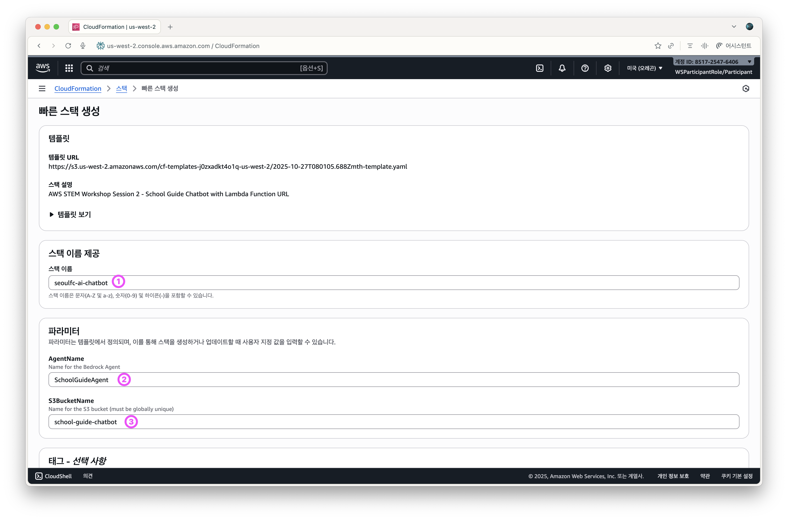
1. 페이지 하단으로 스크롤합니다.

2. 다음 체크박스를 선택합니다:
   > ✅ **"AWS CloudFormation에서 사용자 지정 이름으로 IAM 리소스를 생성할 수 있음을 승인합니다."**

3. **스택 생성** 버튼을 클릭합니다.
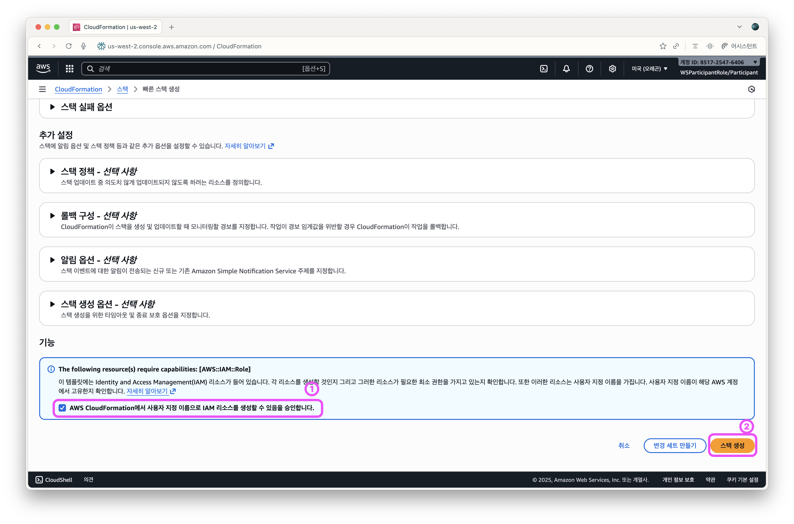


4. 스택 생성이 시작됩니다 (약 1~2분 소요).
   - 상태가 **CREATE_IN_PROGRESS** → **CREATE_COMPLETE**로 변경되면 완료!

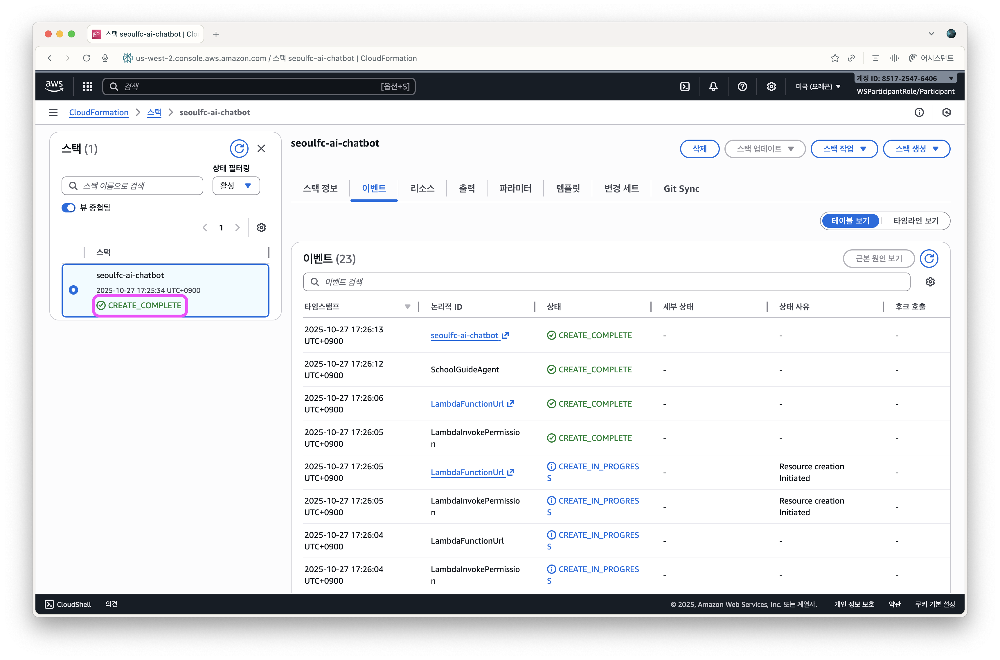

---

#### c. 출력값 확인 및 복사

스택 배포가 완료되면 **출력(Outputs)** 탭을 클릭하여 중요한 값들을 확인합니다.

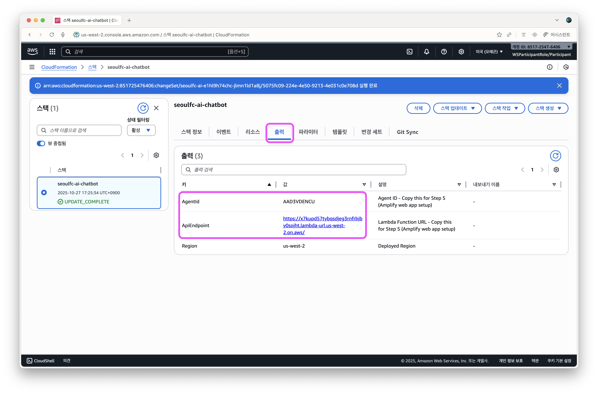
   **다음 값들이 생성되어 있는지 확인해주세요.**
   | 키 | 예시 값 |
   |---|---|
   | **AgentId** | `AAD3VDENCU` |
   | **ApiEndpoint** | `https://x7kupd57t...lambda-url.us-west-2.on.aws/` |
   | **Region** | `us-west-2` |


> 🔥 **중요!** **AgentId**와 **ApiEndpoint** 값을 메모장에 복사해주세요. 추후 실습에 사용할 예정입니다.

---

## Step 2: S3에 학교 안내 문서 업로드

이제 AI가 학습할 서울금융고등학교의 안내 자료를 S3에 업로드할 차례입니다!

#### a. S3 버킷 찾기

1. AWS 콘솔 좌측 상단 검색창에 **S3**를 입력하여 클릭하거나 [S3 콘솔](https://s3.console.aws.amazon.com/s3)로 직접 이동합니다.

2. 생성된 **school-guide-chatbot 버킷**을 찾아 클릭합니다.


---

#### b. PDF 파일 업로드

> 💡 AI가 학습할 학교 안내 자료를 클라우드 저장소에 올라는 과정입니다. 이 파일들을 바탕으로 AI가 질문에 답변하게 됩니다!

1. 버킷 안에서 **업로드** 버튼을 클릭합니다.


2. **파일 추가** 버튼을 클릭합니다.

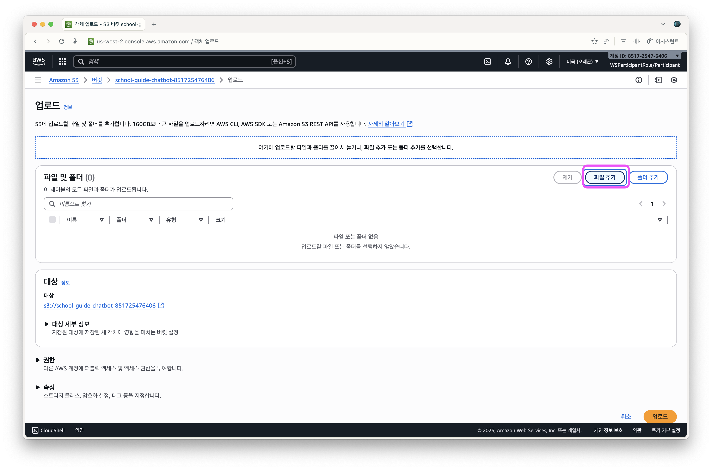

3. 다운로드 받은 학과 소개 PDF 파일을 선택합니다.
   - <a href="/handson/서울금융고_소프트웨어과_학과소개.pdf" download>서울금융고_소프트웨어과_학과소개.pdf</a>
   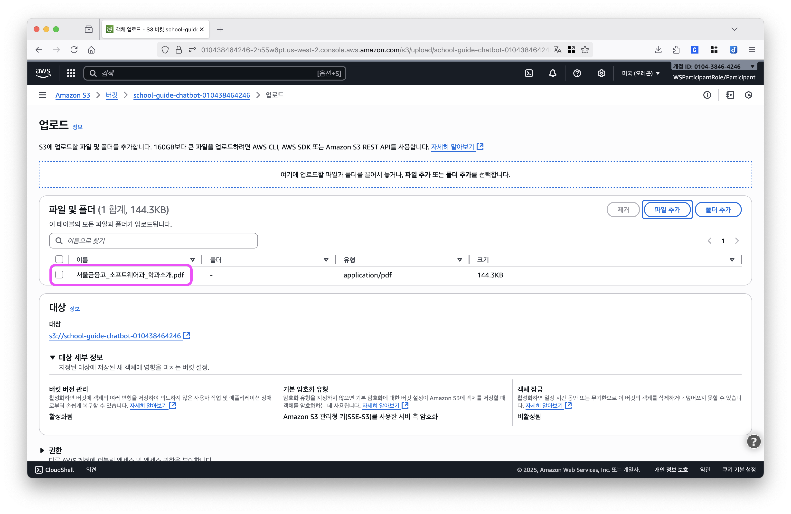

4. 화면 하단의 **업로드** 버튼을 클릭합니다.

5. "업로드 성공" 메시지를 확인합니다.

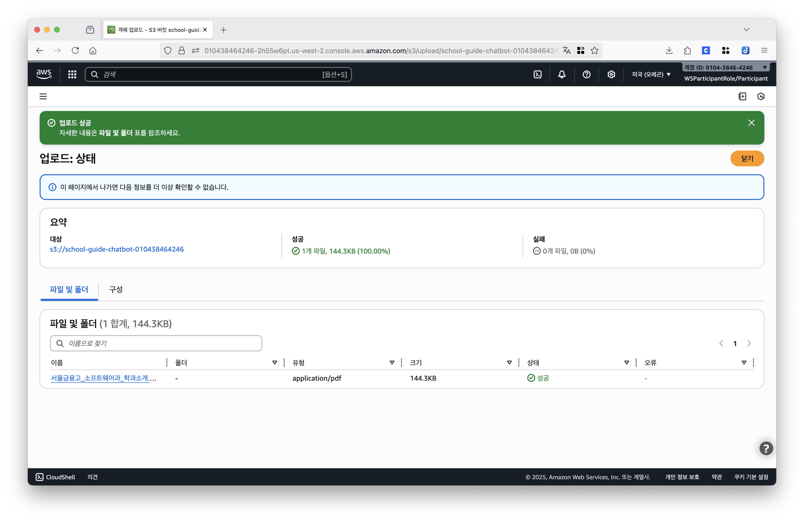

---

## Step 3: Bedrock Knowledge Base 생성

> 🧠 **Knowledge Base란?** AI가 문서를 읽고 이해할 수 있게 만드는 "AI의 두뇌"입니다. PDF를 그냥 업로드만 하면 AI가 읽을 수가 없습니다. 특별한 처리가 필요합니다!

이제 S3에 업로드한 문서를 AI가 읽고 이해할 수 있도록 지식 기반(Knowledge Base)를 만들어봅시다!

#### a. Bedrock 콘솔 접속

1. AWS 콘솔 검색창에 **Bedrock**을 입력하여 클릭하거나 [Bedrock 콘솔](https://us-west-2.console.aws.amazon.com/bedrock/home?region=us-west-2#/knowledge-bases)로 직접 이동합니다.

---

#### b. Knowledge Base 생성

1. 왼쪽 사이드 바에서 **지식 기반**을 선택합니다.

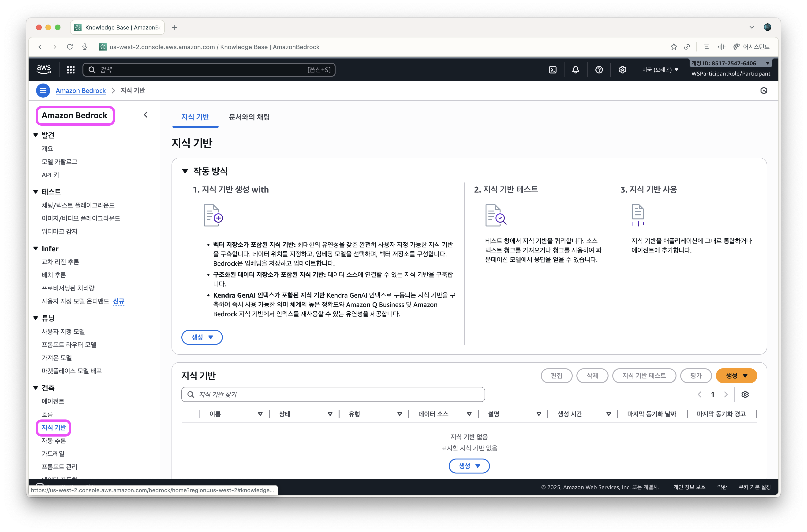

2. **생성** 버튼을 클릭하고, **벡터 저장소가 포함된 지식 기반**을 선택합니다.

> 💡 **벡터 저장소?** 문서를 AI가 이해할 수 있는 숫자 형태로 변환해서 저장하는 곳입니다. 마치 책을 AI 언어로 번역하는 것과 같습니다.

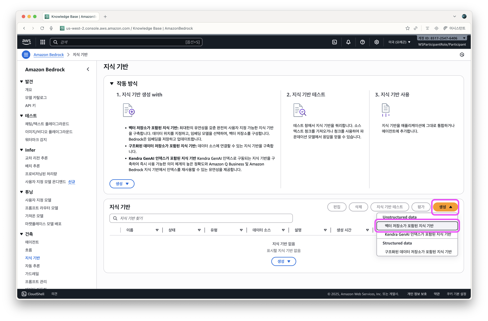

3. **다음** 버튼을 클릭합니다.

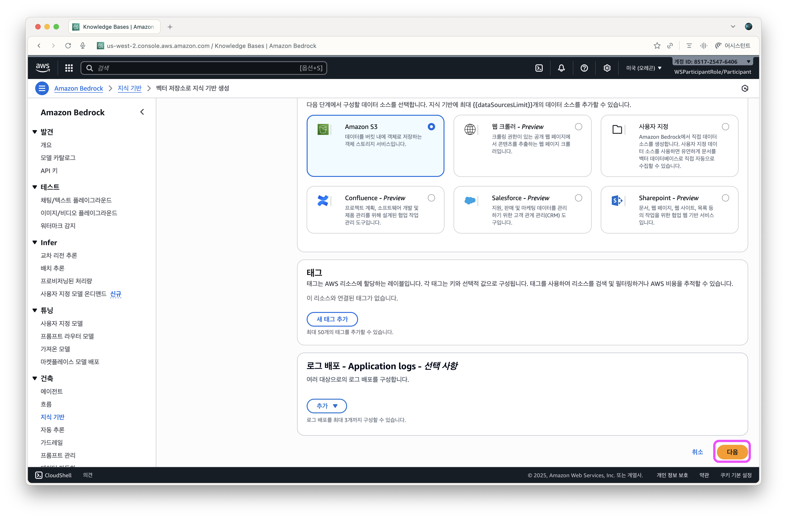

---

#### c. S3 데이터 소스 연결

> 📂 **이 단계에서는:** AI에게 "어디에 있는 문서를 읽을지" 알려줍니다.

1. **Browse S3** 버튼을 클릭합니다.

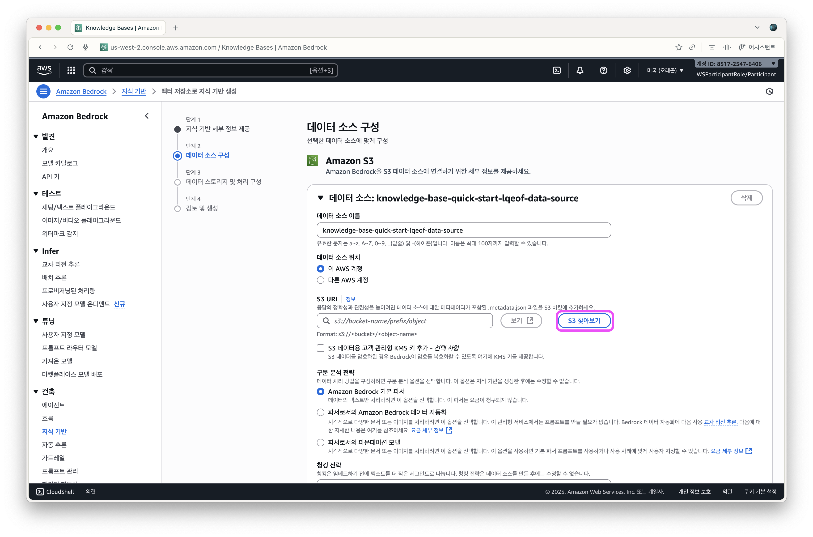

2. Step 2에서 PDF를 업로드한 S3 버킷을 선택하고 **Choose** 버튼을 클릭합니다.

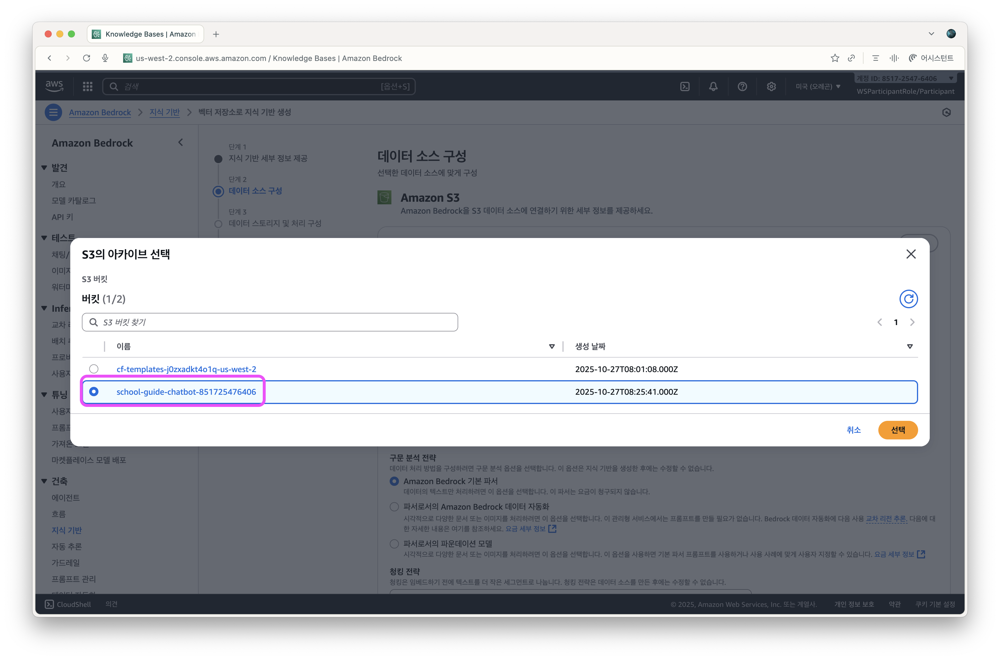

3. **구문 분석 전략**에서 **파운데이션 모델을 파서로 사용**을 선택한 후 **모델 선택**을 클릭합니다.

> 💡 **구문 분석 전략이란?** PDF를 어떻게 읽을지 정하는 방법입니다. 
> - **기본 파서**: 단순하게 텍스트만 추출 (표나 이미지 못 읽음)
> - **파운데이션 모델 파서**: AI가 직접 읽어서 표, 이미지, 복잡한 레이아웃도 이해! ⭐ (더 똑똑함)


4. 드롭다운에서 **Amazon - Nova Premier**를 선택합니다.
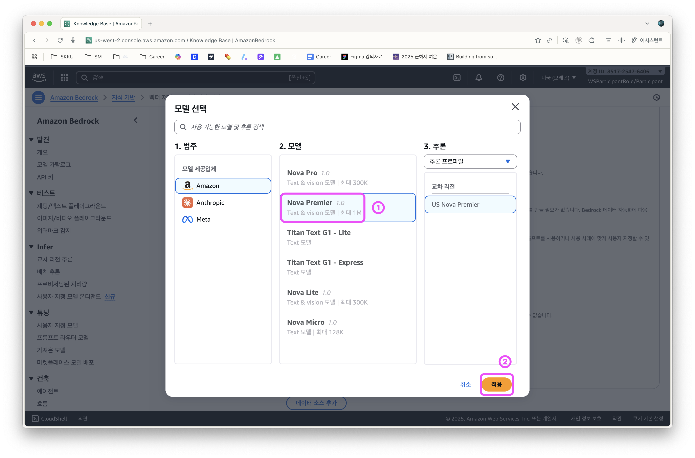

5. **다음** 버튼을 클릭합니다.

---

#### d. 임베딩 모델 설정

> 🔢 **임베딩이란?** 문서의 내용을 숫자로 변환하는 과정입니다. AI는 숫자로 된 데이터를 더 잘 이해해합니다.
> 
> 예: "소프트웨어과" → [0.23, 0.45, 0.12, ...] (수백 개의 숫자)

1. **모델 선택** 버튼을 클릭합니다.
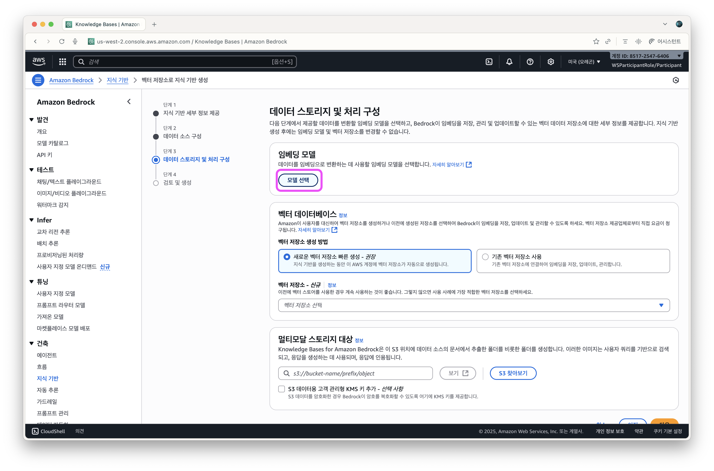

2. **Titan Text Embeddings v2**를 선택하고 **적용** 버튼을 클릭합니다.
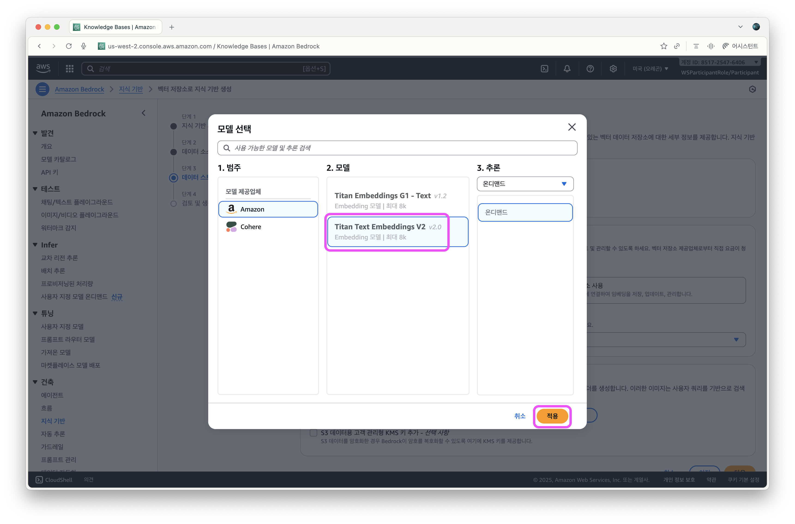

3. **벡터 저장소 선택** 단계에서 **Amazon OpenSearch Serverless**를 선택한 후 **다음** 버튼을 클릭합니다.
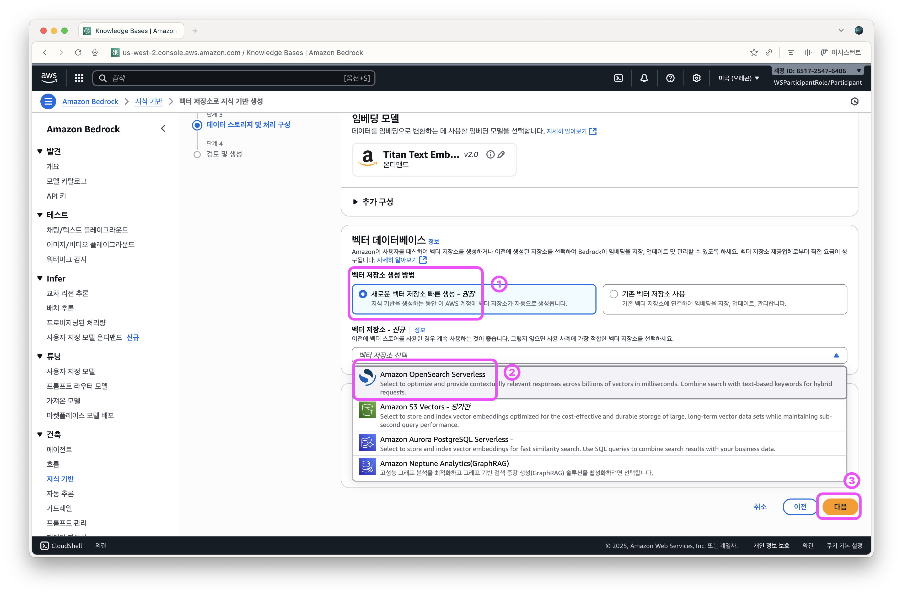

4. **지식 기반 생성** 버튼을 클릭해 지식 기반을 생성합니다.

5. 벡터 데이터베이스 및 지식 기반 생성이 시작됩니다 (약 5분 소요).
   > ⚠️ **주의:** 생성이 완료될 때까지 브라우저 창을 닫지 마세요! 창을 닫으면 생성이 취소됩니다.
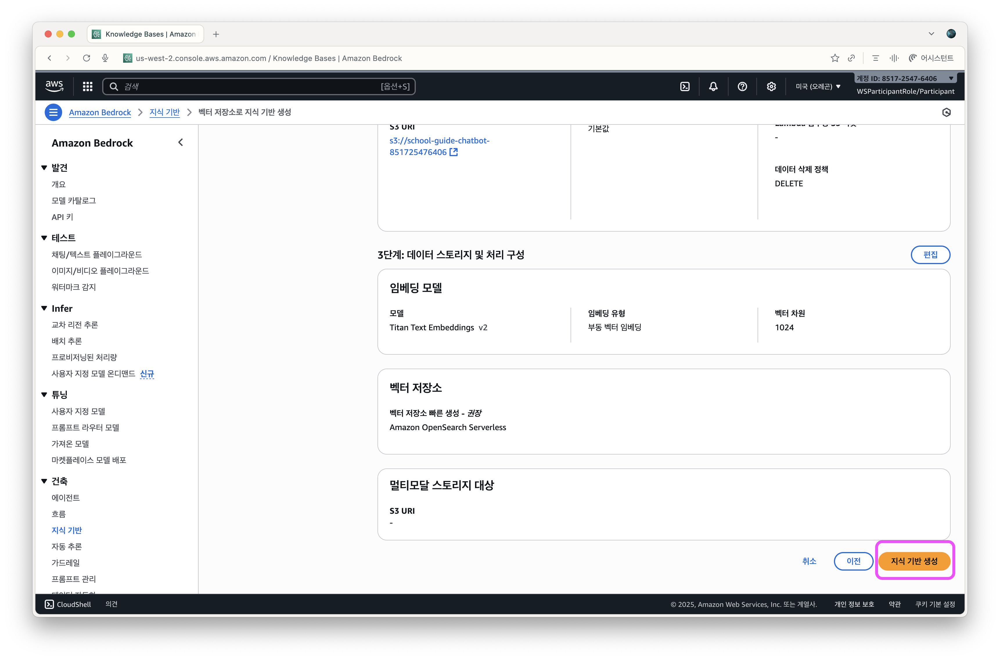


---

#### e. 데이터 동기화

> 🔄 **동기화란?** S3에 있는 PDF 파일을 읽어서 AI가 이해할 수 있는 형태로 변환하는 과정입니다.
> 
> 이 과정이 끝나야 AI가 문서 내용을 기반으로 답변할 수 있어요!

1. Knowledge Base 생성이 완료되면 **동기화** 버튼을 클릭합니다.

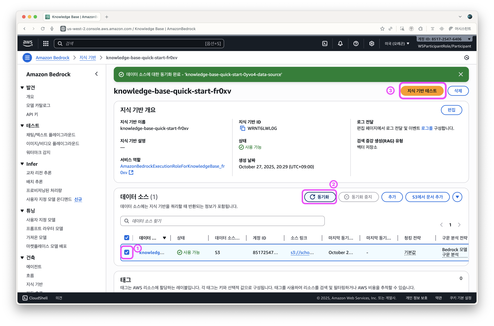

2. 동기화가 시작됩니다 (약 3-5분 소요).
   - 상태가 **동기화 중** → **사용 가능**으로 변경되면 완료!

   > ⚠️ **주의:** 동기화가 완료될 때까지 브라우저 창을 닫지 마세요! 창을 닫으면 동기화가 취소됩니다.

---

## Step 4: Agent에 지식 기반 연결

이제 Agent와 Knowledge Base를 연결하여 질문에 정확하게 답변하는 AI Agent를 완성해봅시다!

#### a. Agent 찾기

1. 왼쪽 사이드바에서 에이전트를 클릭하거나 [Agent 콘솔](https://us-west-2.console.aws.amazon.com/bedrock/home?region=us-west-2#/agents)로 직접 이동합니다.

2. 미리 생성된 **SchoolGuideAgent**를 클릭합니다.

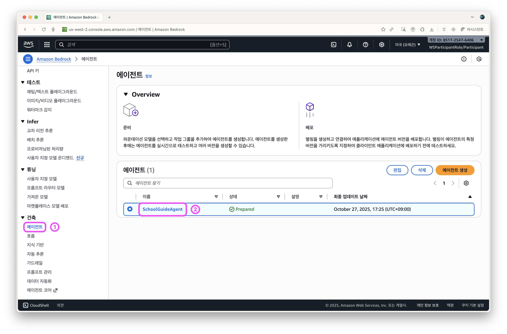

> 💡 **참고:** 이 Agent에는 미리 작성해둔 지침이 입력되어 있습니다. 
>
> 나중에 우리 팀 프로젝트에서는 이런 지침을 직접 작성하게 될 거예요!
 
   <details>
   <summary>📋 이 Agent에 입력된 지침 전체 보기 (클릭)</summary>

   ```markdown
   당신은 서울금융고등학교 소프트웨어과의 안내 도우미 AI입니다.
   학교에 관심 있는 학생과 학부모에게 소프트웨어과의 교육과정, 자격증, 진로, 산학연계 프로그램 등을 친절하게 안내합니다.

   💬 대화 시작
   처음 인사할 때 이렇게 말하세요:
   "안녕하세요! 저는 서울금융고등학교 소프트웨어과 안내 도우미예요 😊
   학교나 학과에 대해 궁금한 걸 물어보세요!"

   🎯 역할
   - 사용자의 질문에 대해 연결된 지식 기반(PDF 문서)을 참고하여 정확하게 안내합니다.
   - 단순한 정보 나열이 아니라, 학생이 이해하기 쉬운 문장으로 설명합니다.

   🗣️ 말투 & 스타일
   - 자연스럽고 따뜻한 말투로, 친근한 선배나 선생님처럼 대화하세요.
   - 문장은 짧고 명확하게, 너무 형식적이거나 딱딱하지 않게 말합니다.

   📘 답변 가이드
   1. 학교 관련 정보는 반드시 지식 기반 내용을 우선 참고하여 답변합니다.
   2. 질문이 불명확하면 "무엇을 도와드릴까요?"라고 안내합니다.
   3. 불필요하게 긴 설명은 피하고, 핵심 내용 중심으로 답변합니다.

   🎓 예시 톤
   - "소프트웨어과는 코딩과 인공지능을 배우는 학과예요."
   - "정보처리기능사, 네트워크관리사 같은 자격증을 취득할 수 있어요."
   ```

   </details>

---

#### b. Knowledge Base 추가

1. Agent 상세 페이지에서 **에이전트 빌더에서 편집** 버튼을 클릭합니다.

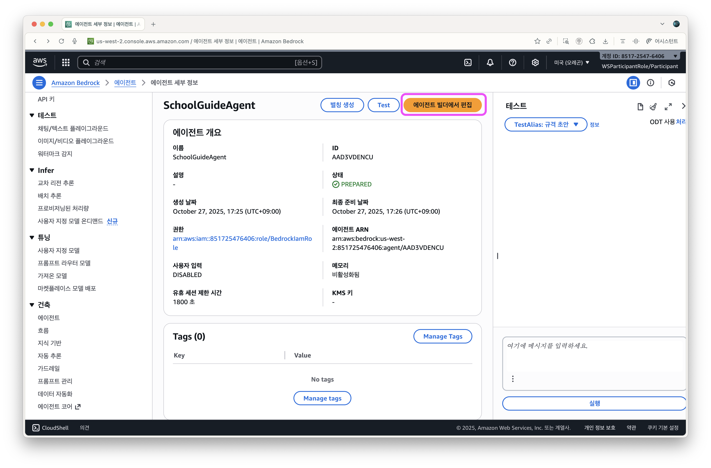

2. 화면을 아래로 스크롤하여 **지식 기반 추가** 버튼을 클릭합니다.

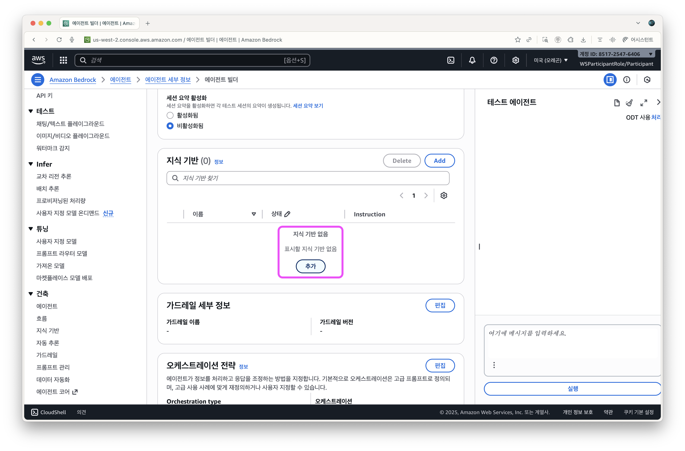

3. **지식 기반 선택**애서 방금 만든 지식 기반을 선택합니다.
   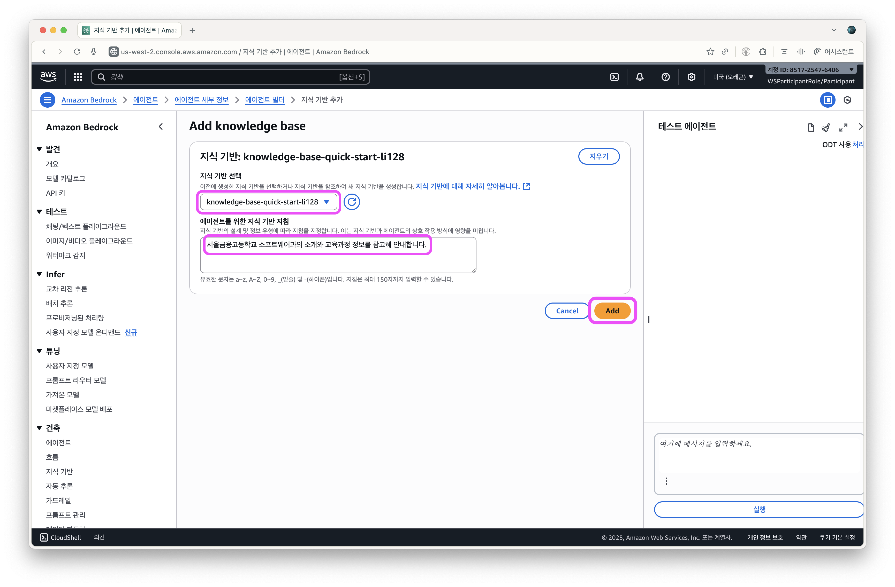

4. **Add** 버튼을 클릭한 뒤 **저장 후 종료** 버튼을 클릭합니다.

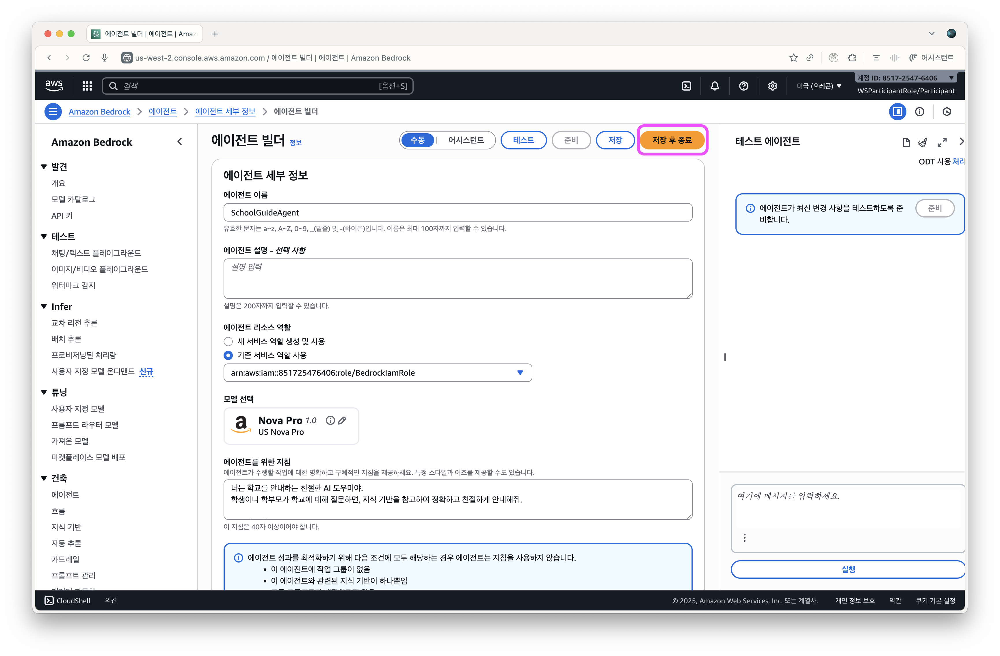

---

#### c. Agent 준비

1. **준비** 버튼을 클릭하여 변경사항을 적용합니다.

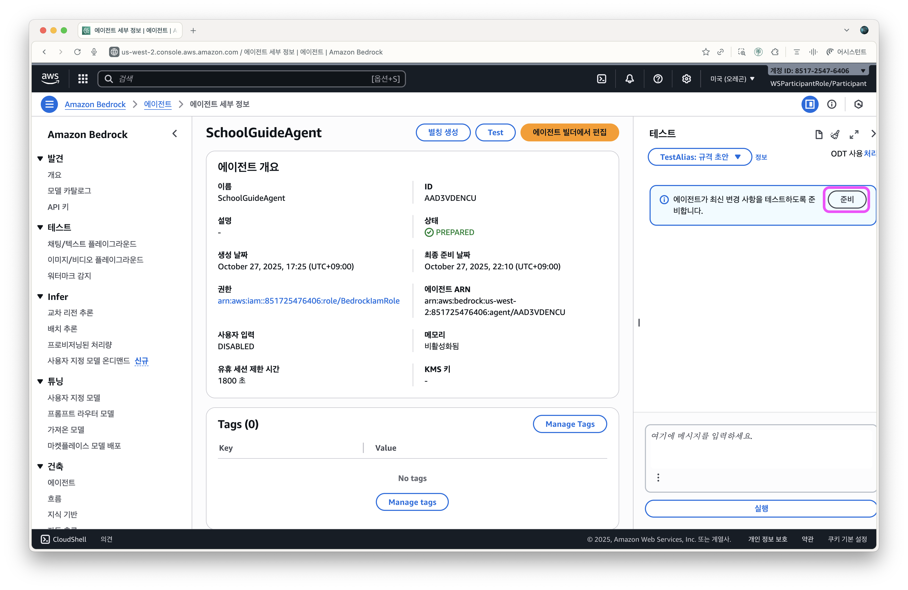

2. 준비가 완료될 때까지 기다립니다 (약 30초-1분).
   - 상태가 **준비 중** → **준비됨**으로 변경되면 완료!

> ✅ **완료!** 이제 Agent가 Knowledge Base와 연결되었습니다.

---

## Step 5: Amplify로 AI Agent 웹사이트 배포 

마지막 단계입니다. AI Agent를 인터넷에 배포하고 직접 체험해봅시다!

#### a. Amplify 앱 생성

1. AWS 콘솔 검색창에 **Amplify**를 입력하여 클릭하거나 [Amplify 콘솔](https://us-west-2.console.aws.amazon.com/amplify)로 직접 이동합니다.

2. **앱 배포** 버튼을 클릭합니다.

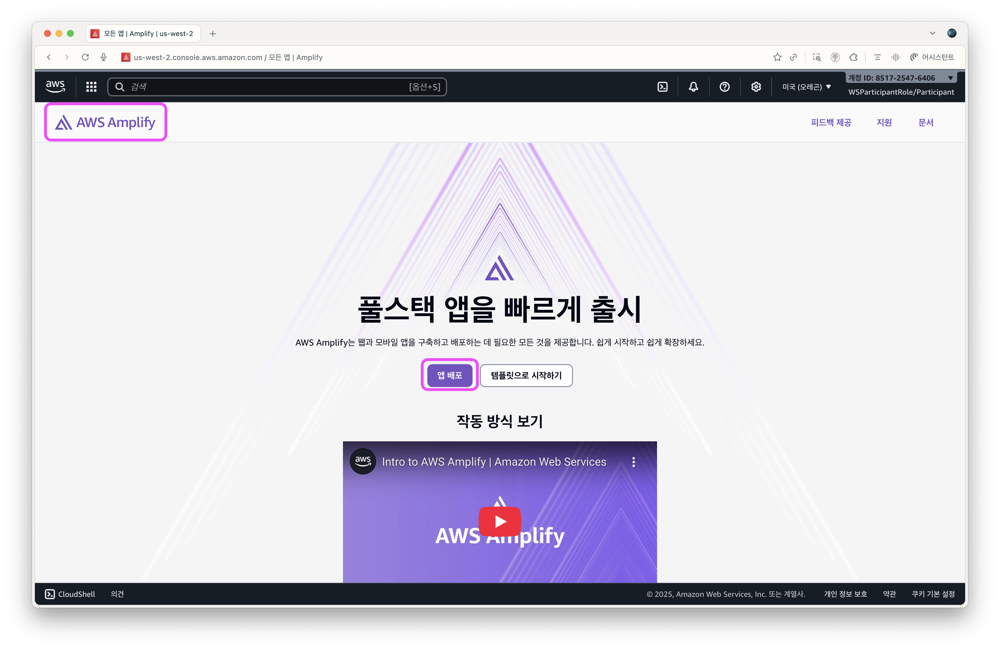

3. **Git 없이 배포**을 선택하고 **다음** 버튼을 클릭합니다.

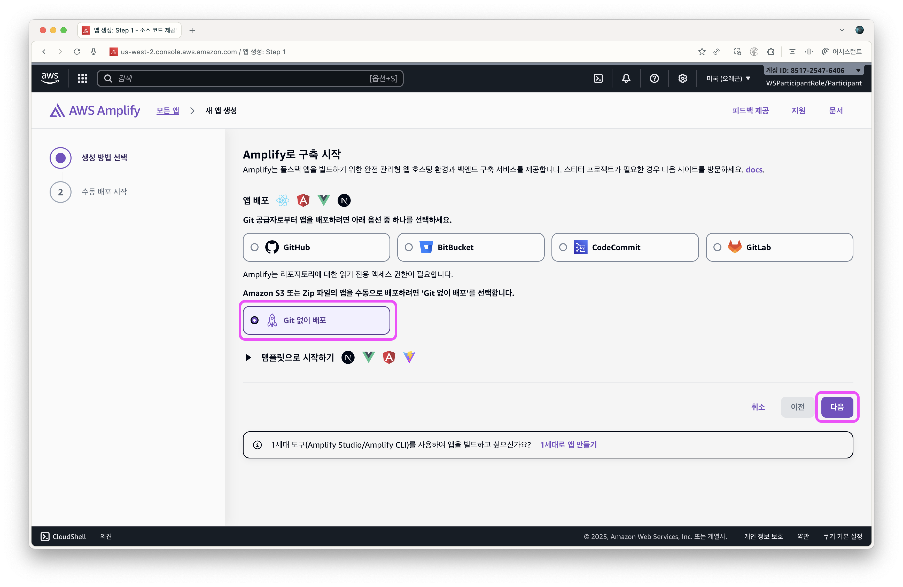

---

#### b. 파일 업로드 및 배포

1. 실습 시작 시 제공된 school_chatbot.zip 파일을 업로드합니다.
2. **저장 및 배포** 버튼을 클릭합니다.
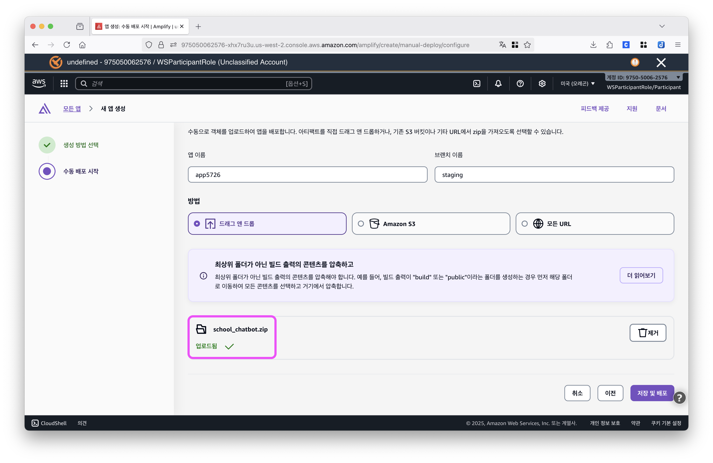


3. 배포가 시작됩니다.
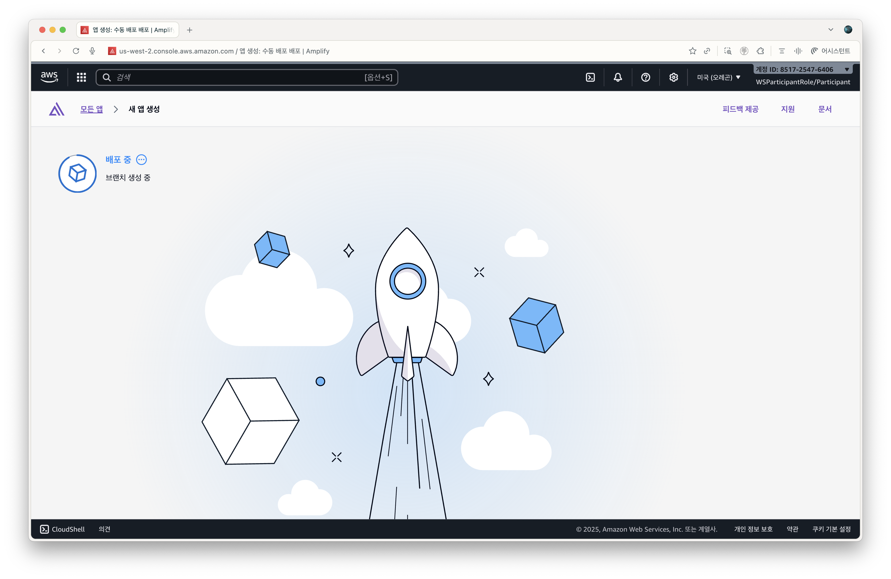

4. **배포된 URL 방문** 버튼을 클릭해 웹사이트에 접속합니다.
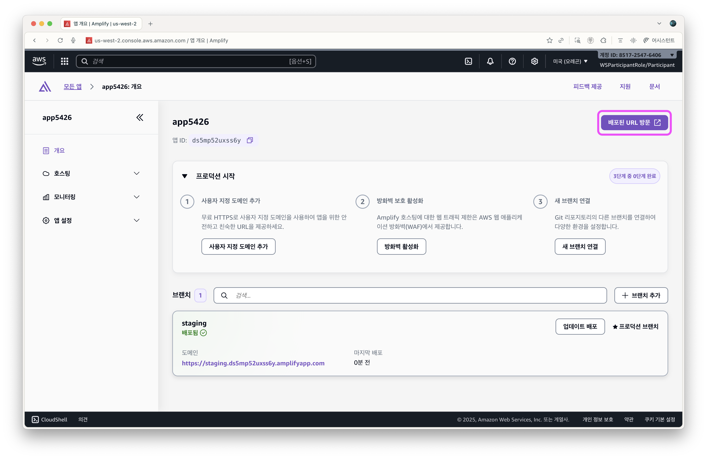


---

#### d. AI Agent 설정 및 테스트

1. 처음 웹사이트에 접속하면 다음과 같은 메인 화면이 표시됩니다.
	- 이때 API Endpoint와 Agent ID 입력이 필요합니다.
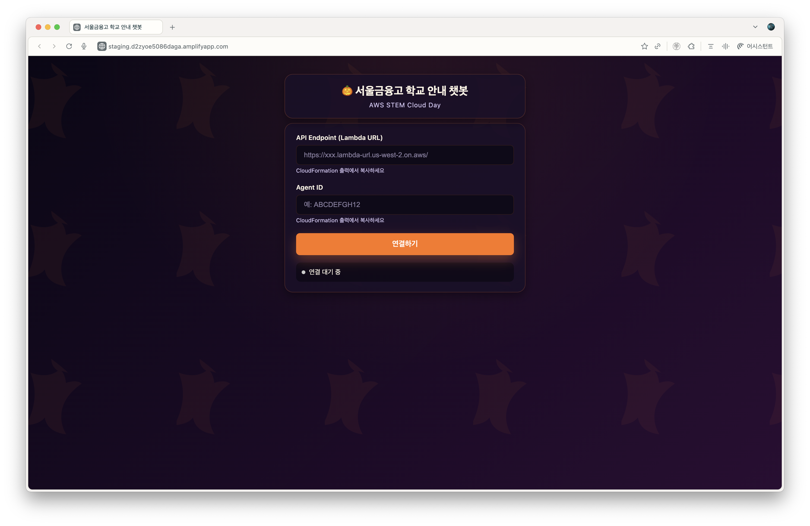

2. 미리 메모장에 복사해둔 **API Endpoint**와 **Agent ID** 값을 복사하거나, [CloudFormation 콘솔](https://us-west-2.console.aws.amazon.com/cloudformation)로 이동하여 스택을 선택한 뒤, **출력** 탭에서 **API Endpoint**와 **Agent ID** 값을 확인합니다.
   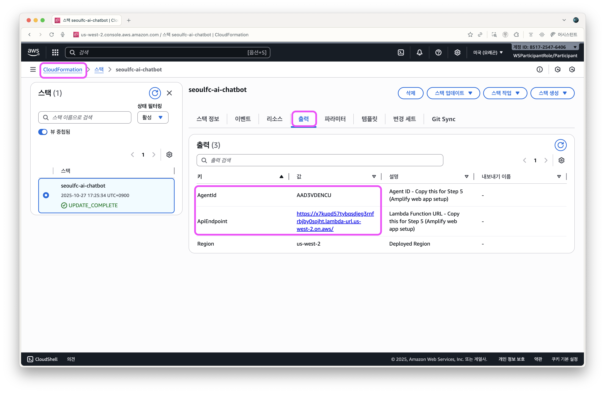

3.	확인한 값을 웹사이트의 입력창에 그대로 입력하고 **연결하기** 버튼을 클릭합니다.

4. 아래와 같은 질문을 시도해봅시다!
   - "소프트웨어과에서 어떤 걸 배우나요?"
   - "졸업하면 어떤 진로가 있나요?"
   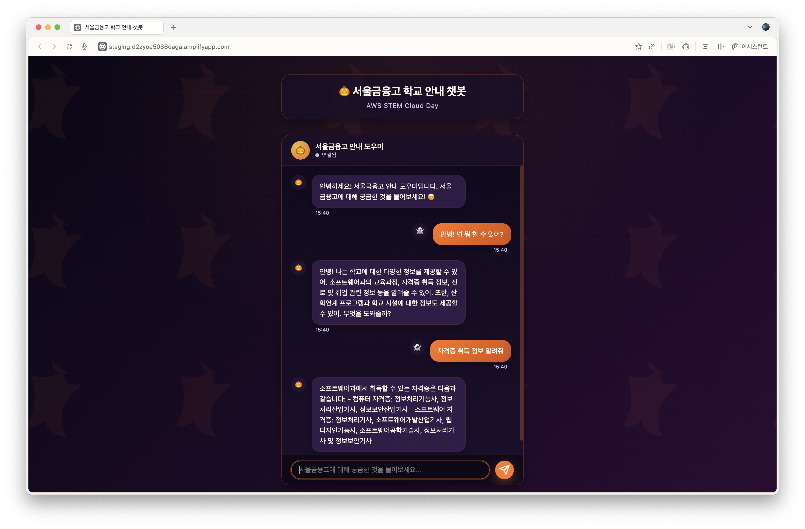

---
축하합니다! 서울금융고 안내 AI Agent가 완성되었습니다!

#### 이제 자유롭게 테스트해보세요!
- "소프트웨어과의 장점은 뭐야?"
- "1학년 때 배우는 과목 알려줘"
- "졸업하면 어디로 취업할 수 있어?"
- "동아리 활동은 어떤 게 있어?"

#### QR 코드를 만들어 핸드폰으로도 찍어보세요!
1. 웹사이트에서 마우스 우클릭
2. "QR 코드 생성" 선택
3. 핸드폰으로 QR 코드 찍어서 접속!


---
## 다음 실습 예고

**다음에는 이와 비슷하게 우리 팀만의 Agent를 만들어볼 거예요!**

- 팀별로 독창적인 주제 선정
- 프롬프트 엔지니어링으로 차별화
- 실시간 데모 및 발표