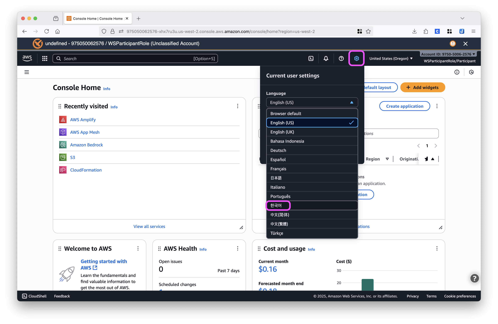

# 자주 나오는 질문

실습 중 자주 발생하는 질문과 문제 해결 방법을 정리했습니다.

> **Tip**: 막히는 부분이 있으면 팀 별로 배정된 멘토분들께 언제든지 편하게 물어보세요! 🐶

---

### Q0: AWS 콘솔이 영어로 되어 있어요!

1. AWS 콘솔 오른쪽 위의 **톱니바퀴 모양(⚙️)** 버튼을 클릭합니다.

2. **Language** 또는 항목을 찾아 **한국어**를 선택합니다.

3. 페이지가 새로고침되면서 한국어로 변경됩니다.

---

### Q1: AccessDeniedException 오류가 발생해요!

**증상**: "Access denied when calling Bedrock. Check your request permissions and retry the request." 
또는 "AccessDeniedException" 메시지가 뜹니다.

**원인**: IAM 권한이 제한되어 있는 경우입니다.

**해결 방법** (순서대로 시도):

1. **리전 확인** (가장 흔한 원인)
   
   실습 환경은 **us-west-2 (오레곤)** 리전만 허용됩니다!
   
   - AWS 콘솔 우측 상단 리전 확인
   - ap-northeast-2 (서울) 등으로 되어 있으면 권한 오류 발생
   - **해결**: 우측 상단 리전 선택 → us-west-2 (오레곤) 선택

2. **모델 버전 확인**
   
   Workshop 임시 계정을 사용 중이기 때문에, 최신 Foundation Model은 아직 권한이 부여되지 않았을 수 있습니다.
   
   - Amazon Nova 시리즈 사용
   - 또는 실습 가이드에서 안내한 모델 사용

3. **예비 계정 사용**
   
   1, 2번을 모두 시도했는데도 안 되는 경우에는 팀 멘토분께 도움을 요청하고, 미리 준비해둔 예비 계정으로 전환해주세요.

---

### Q2: "데이터를 동기화하지 못했습니다" 오류가 떠요!

**증상**: Knowledge Base 동기화 시 오류 메시지

**원인**: 동기화 버튼을 여러 번 눌러서 발생할 수 있습니다.

✅ 동기화는 시간이 걸립니다 (3-5분)  
✅ 버튼을 한 번만 누르고 기다려주세요.  
✅ 여러 번 누르면 오류 메시지가 뜨지만, 처음 눌렀을 때 이미 동기화가 시작되었습니다.

**확인 방법:**
1. 페이지 새로고침 (F5)
2. 데이터 소스 상태 확인
3. "사용 가능" 또는 "동기화 중" 상태 확인

---

### Q3: AI Agent가 "대답할 수 없습니다"라고만 해요!

**증상**: 
- "사용자의 질문이 불명확합니다. 무엇을 도와드릴까요?"
- "Sorry, I am unable to assist you with this request."

**원인**: 질문이 너무 짧거나 불명확한 경우 발생합니다.

**해결 방법**: 구체적이고 완전한 문장으로 질문해주세요.

**질문 예시**
- "소프트웨어과에서 어떤 과목을 배우나요?"
- "1학년 교육과정에 대해 자세히 알려주세요"
- "졸업 후 진로는 어떻게 되나요?"

---

### Q4: AI Agent가 엉뚱한 답변을 해요!

**원인**: Knowledge Base 동기화 또는 Agent 준비가 제대로 안 된 경우

**1. Knowledge Base 동기화 확인**
- Bedrock 콘솔 → 지식 기반 → 데이터 소스
- 상태가 **사용 가능** 인지 확인하기

**2. Agent 준비 확인**
- Agent 편집 후 반드시: "저장 후 종료" → "준비" 버튼 클릭 → 완료 대기 (30초-1분)
> ⚠️ 준비하지 않으면 변경사항이 반영되지 않습니다!

---

### Q5: 웹에서 AI Agent 연결이 안 돼요!

**증상**: "연결 실패" 또는 "오류 발생" 메시지

1. **API Endpoint 확인**
   
   CloudFormation → 스택 선택 → 출력 탭
   
   **확인 사항:**
   - ✅ URL이 `https://`로 시작하는지
   - ✅ 복사 시 공백이나 줄바꿈이 없는지
   - ✅ 전체 URL을 복사했는지
   
   **올바른 형식:** `https://xxxxx.lambda-url.us-west-2.on.aws/`

2. **Agent ID** 확인
   
3. **브라우저 새로고침**
   1. 웹 페이지 새로고침 (F5)
   2. 다시 API Endpoint와 Agent ID 입력
   3. "연결하기" 클릭

---

### Q6: 여기에 없는 문제가 발생했어요!

> 🙋 팀 멘토분들께 언제든지 도움 요청해주세요!