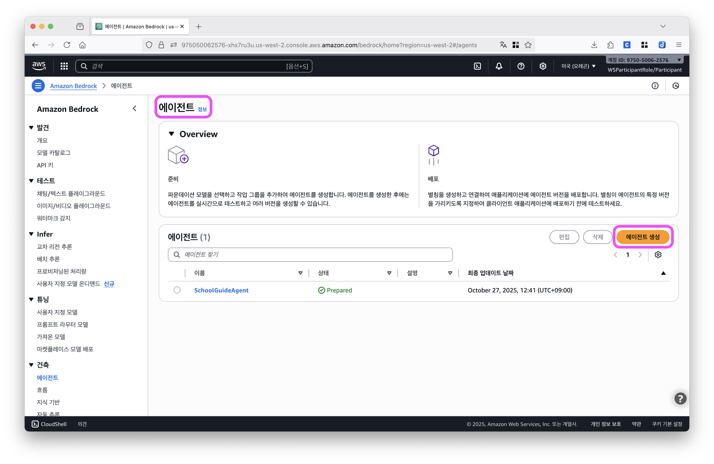
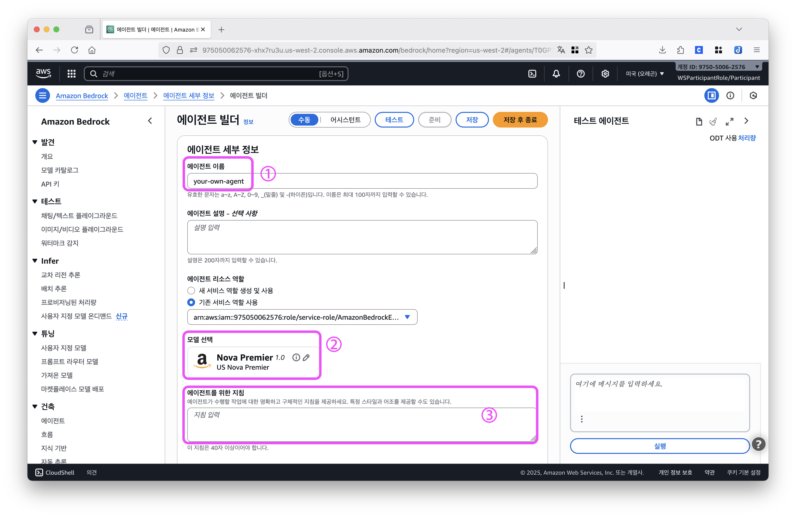
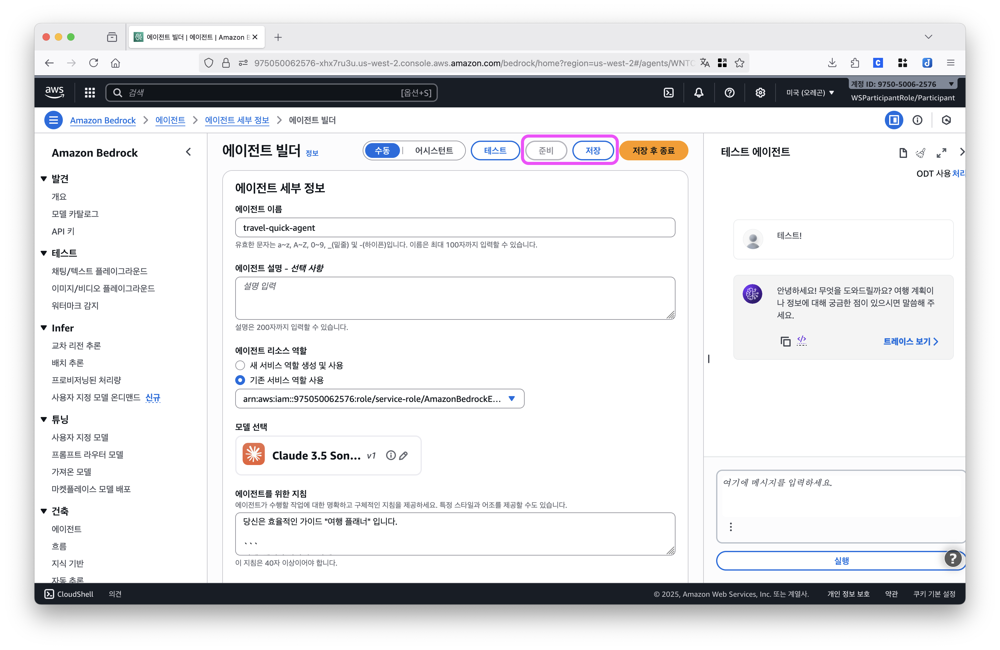

# 우리만의 AI Agent 만들기

이제 우리 팀만의 AI Agent를 만들어볼 시간입니다.

지금까지 클라우드 컴퓨팅의 개념, Amazon Bedrock을 활용한 AI Agent 구축 방법, 그리고 프롬프트 엔지니어링 기법까지 배웠습니다. 이 모든 지식을 바탕으로 우리 팀만의 독창적인 AI Agent를 자유롭게 만들어볼까요?

---

## 1단계: 주제 선정

#### a. 주제 정하기

팀원들과 함께 어떤 AI Agent를 만들지 정해보세요.

**주제 예시:**
- 🎃 **할로윈 파티 플래너**: 코스튬 추천, 파티 게임, 분위기 연출 아이디어
- ✈️ **여행 메이트**: 여행지 추천, 현지 팁, 예산 계획
- 🎬 **영화 큐레이터**: 취향 분석 후 영화 추천, 숨은 명작 소개

#### b. 차별화 포인트 고민하기

- **성격**: 친근한 친구 같은 느낌? 전문가 느낌?
- **말투**: 반말로 편하게? 존댓말로 정중하게?
- **스타일**: 짧고 간결하게? 자세하고 친절하게?

> 💡 주제 선정이 어렵다면 [아이디어 모음 페이지](./2-ideas.md)에서 더 많은 예시를 참고해보세요!

---

## 2단계: Agent 생성

#### a. Agent 콘솔로 이동

왼쪽 사이드바에서 **에이전트**를 클릭하거나, [Agent 콘솔](https://us-west-2.console.aws.amazon.com/bedrock/home?region=us-west-2#/agents)로 직접 이동합니다.



#### b. 에이전트 생성 시작

**에이전트 생성** 버튼을 클릭해 우리 팀만의 AI Agent를 만들어봅시다!



#### c. 세 가지 항목 입력하기

**1. 에이전트 이름**

우리 팀의 주제를 담은 이름을 자유롭게 지어주세요. (영어로 작성)

예시: `travel-guide-agent`, `cooking-helper`, `study-mentor`

**2. 모델 선택**

기본값은 Claude 3.5 Sonnet이지만, 교육용 계정에서는 Claude 사용에 제한이 있어 사용이 불가능합니다. 

**Amazon Nova 시리즈 중 하나를 선택해주세요:**
- Nova Pro
- Nova Premier
- Nova Lite
- Nova Micro

> 💡 나중에 다른 모델로 바꿔가며 테스트하며, 우리 팀만의 모델을 선택해주세요.

**3. 에이전트 지침**

아래 기본 템플릿을 복사해서 시작해주세요. 대괄호 `[ ]` 안의 내용을 우리 팀의 아이디어로 채워넣으면 됩니다.

```markdown
# 역할
당신은 [구체적인 역할]입니다.

# 주요 업무
- [업무 1]
- [업무 2]

# 답변 스타일
- 말투: [반말/존댓말]
- 이모티콘: [많이/적당히/안 함]
- 답변 길이: [간단/보통/자세히]

# 제약사항
- [하지 말아야 할 것]
```

#### d. 저장 및 테스트



1. **저장** 버튼을 클릭합니다.
2. **준비** 버튼을 클릭해서 Agent를 활성화합니다.
3. 오른쪽 테스트 패널에서 질문을 입력해 테스트해보세요.

> ⚠️ **중요:** 모델을 바꾸거나 지침을 수정할 때마다 **저장 → 준비** 버튼을 다시 클릭해야 최신 버전으로 업데이트됩니다!
---

## 3단계: 프롬프트 기법 추가

#### a. 프롬프팅 기법 적용하기

[이전 페이지](./0-prompt-engineering.md)에서 배운 프롬프트 기법 중 1-3개를 골라 에이전트 지침에 추가해주세요.

- **Few-Shot**: 예시를 제공해서 원하는 답변 형식 보여주기
- **Chain of Thought**: 단계별로 생각하도록 유도하기
- **Step-by-Step Instructions**: 순차적으로 처리하도록 지시하기

#### b. 테스트하고 개선하기

1. **에이전트 지침 수정**
   - 프롬프팅 기법을 추가하거나 내용을 다듬습니다

2. **저장 → 준비**
   - 변경사항을 저장하고 준비 버튼 클릭 (1분 정도 대기)

3. **테스트 패널에서 질문 입력**
   - 다양한 질문으로 Agent 응답 확인

4. **결과 확인 후 수정**
   - 말투가 일관되나요?
   - 원하는 스타일로 답변하나요?
   - 개선이 필요한 부분을 찾아 수정합니다

5. **2-4번 과정을 반복**
   - 반복할수록 완성도가 높아집니다!
---

## 4단계: 팀별 발표

#### a. 발표 준비하기

노트북을 들고 앞으로 나와서 발표해주세요!

#### b. 발표 순서

1. **팀 소개**
   - 우리 팀의 Agent 이름과 컨셉 소개

2. **프롬프트 소개**
   - 작성한 프롬프트 보여주기
   - 어떤 프롬프팅 기법을 추가했는지 설명

3. **실시간 시연** 
   - Bedrock 콘솔 테스트 패널에서 질문 입력
   - Agent 응답 확인